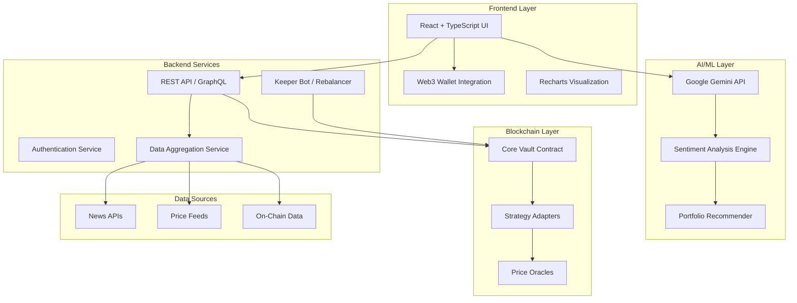

# Quantum Matrix - Master Plan
## Modular DeFi Portfolio Manager with AI-Driven Multi-Chain Rebalancing

<div align="center">

**Version 1.0** | **Last Updated: December 24, 2024**

*A drag-and-drop quantitative strategy platform for cross-chain DeFi portfolio management*

</div>

---

## Executive Summary

**Quantum Matrix** is a next-generation DeFi portfolio management platform that treats quantitative strategies as composable "LEGO blocks." Users can drag-and-drop strategies onto their assets to create sophisticated, multi-layered portfolio allocations. The platform features AI-driven sentiment analysis powered by Google Gemini, enabling automated rebalancing across multi-chain ecosystems (Ethereum, Solana, Arbitrum, and beyond).

### Current Implementation Status
- ✅ **Frontend UI**: Fully functional drag-and-drop interface with brutalist design
- ✅ **AI Integration**: Gemini-powered sentiment analysis and portfolio recommendations
- ✅ **Multi-Chain Support**: Ethereum, Solana, Arbitrum ecosystems
- ✅ **Strategy Library**: 6 quantitative strategies (Mean Reversion, Delta-Gamma, Momentum, etc.)
- 🚧 **Smart Contracts**: Not yet implemented
- 🚧 **Backend Infrastructure**: Not yet implemented
- 🚧 **Real-time Data Feeds**: Not yet implemented

---

## 1. Product Core

### 1.1 Vision & Value Proposition

**Vision**: Democratize institutional-grade quantitative trading strategies for retail DeFi users through an intuitive, visual interface.

**Core Value Propositions**:
1. **Composability**: Stack multiple strategies with conditional triggers (e.g., "50% Yield Always + 50% Momentum when Bullish")
2. **AI-Powered Intelligence**: Real-time sentiment analysis drives automated rebalancing recommendations
3. **Multi-Chain Native**: Seamless portfolio management across L1s and L2s
4. **Risk-Aware**: Clear risk labeling (Low/Medium/High/Degen) with APY projections
5. **No-Code Quant**: Professional strategies accessible without coding or deep DeFi knowledge

### 1.2 Core Features

#### 1.2.1 Strategy LEGO System
- **Drag-and-Drop Interface**: Visual strategy composition onto individual assets
- **Conditional Execution**: Strategies activate based on market conditions:
  - `Always`: Unconditional execution
  - `Bullish/Bearish/Neutral`: Sentiment-triggered
  - `Euphoric`: Extreme greed conditions
  - `High Volatility`: VIX-equivalent triggers
  - `AI Adaptive`: Dynamic activation based on AI risk assessment
- **Weight Allocation**: Percentage-based strategy weighting (auto-normalized to 100%)
- **Layer Visualization**: Clear visual representation of strategy stacks per asset

#### 1.2.2 AI Sentiment Engine
- **News Aggregation**: Real-time crypto news feed analysis
- **Sentiment Scoring**: 0-100 scale (Fear → Greed)
- **Trend Detection**: Identifies emerging narratives (L2 Scaling, Restaking, AI Tokens)
- **Portfolio Recommendations**: AI suggests optimal strategy stacks per ecosystem
- **Historical Tracking**: Sentiment score time-series visualization

#### 1.2.3 Multi-Chain Portfolio Management
- **Unified Dashboard**: Single interface for all chains
- **Ecosystem Switching**: Tab-based navigation between chains
- **Asset Aggregation**: Total portfolio value across all ecosystems
- **Cross-Chain Rebalancing**: (Future) Automated bridging for optimal allocation

#### 1.2.4 Strategy Library (Current)
| Strategy | Type | Risk | APY | Description |
|----------|------|------|-----|-------------|
| Mean Reversion v4 | Quant | Medium | 18.5% | Statistical arbitrage on price deviations |
| Delta-Gamma Hedged | Delta Neutral | Low | 12.2% | Market-neutral options vault |
| Alpha Momentum | Momentum | High | 45.0% | Trend-following with on-chain signals |
| Recursive Staking | Leverage | High | 24.5% | Leveraged liquid staking loops (3x) |
| Basis Arbitrage | Yield | Low | 8.5% | Spot-futures spread capture |
| Hyper-Liquidity | Yield | Degen | 150.5% | High-risk incentivized pools |

### 1.3 User Personas

1. **DeFi Degen** (Primary)
   - Experienced DeFi user seeking higher yields
   - Comfortable with high risk for high returns
   - Wants automation but maintains control

2. **Institutional Allocator** (Secondary)
   - Managing $1M+ portfolios
   - Requires risk management and reporting
   - Values backtested strategies with proven track records

3. **Crypto Curious** (Tertiary)
   - New to DeFi, overwhelmed by complexity
   - Wants "set-and-forget" AI-driven portfolios
   - Prioritizes safety and education

### 1.4 Success Metrics (KPIs)

**User Engagement**:
- Daily Active Users (DAU)
- Average strategies per portfolio
- AI auto-rebalance acceptance rate

**Financial Performance**:
- Total Value Locked (TVL)
- Average portfolio APY vs. benchmark (e.g., holding ETH)
- Sharpe ratio of AI-recommended portfolios

**Technical Health**:
- Transaction success rate
- Average gas cost per rebalance
- Cross-chain bridge success rate

---

## 2. Architectural Overview

### 2.1 System Architecture



### 2.2 Technology Stack

#### Frontend
- **Framework**: React 18 + TypeScript
- **Build Tool**: Vite
- **Styling**: Vanilla CSS (Brutalist Design System)
- **Charts**: Recharts
- **Web3**: ethers.js / wagmi / viem
- **State Management**: React Hooks (useState, useEffect, useMemo)

#### Backend (Planned)
- **Runtime**: Node.js 20+
- **Framework**: Express.js or Fastify
- **Database**: PostgreSQL (user data, historical allocations)
- **Cache**: Redis (price feeds, sentiment scores)
- **Queue**: Bull (async rebalancing jobs)

#### Smart Contracts
- **Language**: Solidity 0.8.20+
- **Framework**: Foundry
- **Upgradability**: UUPS Proxy Pattern
- **Testing**: Forge + Hardhat

#### AI/ML
- **Primary**: Google Gemini 3 Flash Preview
- **Fallback**: OpenAI GPT-4 (for redundancy)
- **Data Pipeline**: Python (for advanced statistical models)

#### Infrastructure
- **Hosting**: Vercel (frontend), AWS/GCP (backend)
- **Monitoring**: Datadog, Sentry
- **CI/CD**: GitHub Actions
- **Secrets**: Doppler

### 2.3 Data Flow

#### User Action Flow
1. User drags strategy onto asset → Frontend updates local state
2. User clicks "AI Auto-Pilot" → Gemini analyzes sentiment → Returns recommendations
3. User approves → Transaction constructed → Wallet signs → Blockchain execution
4. Keeper bot monitors → Executes conditional rebalances → Updates UI

#### Real-Time Data Flow
1. Price feeds (Chainlink/Pyth) → Backend aggregator → WebSocket → Frontend
2. News APIs → Sentiment analysis → Score update → Historical chart update
3. On-chain events → Indexer → Database → API → UI refresh

### 2.4 Security Architecture

**Frontend Security**:
- Content Security Policy (CSP)
- Input sanitization for user-generated data
- Wallet signature verification

**Smart Contract Security**:
- Access control (Ownable, role-based)
- Reentrancy guards
- Emergency pause mechanism
- Timelock for upgrades

**Backend Security**:
- Rate limiting (per IP, per user)
- API key rotation
- Database encryption at rest
- HTTPS/TLS for all communications

---

## 3. Statistical Model Specifications

### 3.1 Sentiment Analysis Model

#### Input Data Sources
1. **Crypto News APIs**:
   - CoinDesk, CoinTelegraph, The Block
   - Twitter/X trending topics (#crypto, #DeFi)
   - Reddit sentiment (r/cryptocurrency, r/ethfinance)

2. **On-Chain Metrics**:
   - Exchange inflows/outflows
   - Whale wallet movements
   - Gas price trends (network activity proxy)

3. **Market Data**:
   - Fear & Greed Index
   - Funding rates (perpetual futures)
   - Options implied volatility

#### Gemini Prompt Engineering
```
Analyze the following crypto market news headlines and on-chain metrics.

Headlines: [...]
Exchange Flows: [...]
Funding Rates: [...]

Return JSON:
{
  "score": 0-100,  // 0=Extreme Fear, 100=Extreme Greed
  "label": "Bearish" | "Neutral" | "Bullish" | "Euphoric",
  "summary": "One sentence market summary",
  "trendingTopics": ["Topic1", "Topic2", ...],
  "confidence": 0-1  // Model confidence in assessment
}
```

#### Sentiment Score Calibration
- **0-20**: Extreme Fear (Capitulation)
- **21-40**: Bearish (Risk-off)
- **41-60**: Neutral (Sideways)
- **61-80**: Bullish (Risk-on)
- **81-100**: Euphoric (Mania)

### 3.2 Portfolio Optimization Model

#### Objective Function
Maximize risk-adjusted returns (Sharpe ratio) subject to constraints:

```
Maximize: Σ(wi × ri) / σp
Subject to:
  Σwi = 1                    (weights sum to 100%)
  wi ≥ 0                     (no short positions)
  risk_score ≤ user_tolerance (risk constraint)
  gas_cost < expected_profit  (economic viability)
```

Where:
- `wi` = weight of strategy i
- `ri` = expected return of strategy i
- `σp` = portfolio volatility

#### Strategy Selection Algorithm
1. **Filter by Sentiment**: Match strategy type to market condition
   - Bearish → Yield, Delta Neutral
   - Neutral → Mean Reversion, Basis Arb
   - Bullish → Momentum, Leverage
   - Euphoric → Reduce leverage, take profits

2. **Risk Parity**: Allocate based on inverse volatility
   ```
   wi = (1/σi) / Σ(1/σj)
   ```

3. **AI Enhancement**: Gemini adjusts weights based on:
   - Recent strategy performance
   - Trending narratives (e.g., "Restaking" → boost LST strategies)
   - Black swan risk indicators

### 3.3 Rebalancing Trigger Model

#### Condition Evaluation
Each strategy layer has a `condition` field. Evaluation logic:

```typescript
function shouldExecute(layer: StrategyLayer, sentiment: MarketSentiment): boolean {
  switch (layer.condition) {
    case 'Always': return true;
    case 'Bullish': return sentiment.score >= 61;
    case 'Bearish': return sentiment.score <= 40;
    case 'Neutral': return sentiment.score > 40 && sentiment.score < 61;
    case 'Euphoric': return sentiment.score >= 81;
    case 'High Volatility': return getVolatility() > threshold;
    case 'AI Adaptive': return aiRiskMatch(layer.strategyId, sentiment);
  }
}
```

#### Rebalancing Frequency
- **User-Triggered**: Instant execution
- **AI Auto-Pilot**: 
  - Check every 4 hours
  - Execute if:
    - Sentiment score changes >15 points
    - Trending topic matches strategy tag
    - Expected profit > gas cost + 5%

### 3.4 Risk Scoring Model

#### Strategy Risk Score
```
risk_score = (
  0.4 × leverage_factor +
  0.3 × historical_volatility +
  0.2 × smart_contract_risk +
  0.1 × liquidity_risk
)
```

#### Portfolio Risk Score
```
portfolio_risk = Σ(wi × risk_scorei)
```

**Risk Labels**:
- 0-25: Low
- 26-50: Medium
- 51-75: High
- 76-100: Degen

---

## 4. Key Smart Contract Junctions

### 4.1 Contract Architecture

```
CoreVault (UUPS Proxy)
├── StrategyRegistry
├── AssetManager
├── RebalanceExecutor
└── Adapters/
    ├── AaveAdapter
    ├── UniswapV3Adapter
    ├── GMXAdapter
    ├── LidoAdapter
    └── CustomStrategyAdapter
```

### 4.2 Core Vault Contract

**Purpose**: Central hub for user deposits, strategy allocation, and rebalancing.

```solidity
// SPDX-License-Identifier: MIT
pragma solidity ^0.8.20;

import "@openzeppelin/contracts-upgradeable/proxy/utils/UUPSUpgradeable.sol";
import "@openzeppelin/contracts-upgradeable/access/OwnableUpgradeable.sol";
import "@openzeppelin/contracts-upgradeable/security/ReentrancyGuardUpgradeable.sol";

contract CoreVault is UUPSUpgradeable, OwnableUpgradeable, ReentrancyGuardUpgradeable {
    
    struct StrategyLayer {
        address strategyAdapter;
        uint8 condition;  // 0=Always, 1=Bullish, 2=Bearish, etc.
        uint16 weight;    // Basis points (10000 = 100%)
    }
    
    struct UserAllocation {
        address asset;
        StrategyLayer[] layers;
    }
    
    mapping(address => mapping(address => UserAllocation)) public userAllocations;
    mapping(address => bool) public approvedAdapters;
    
    event Deposit(address indexed user, address indexed asset, uint256 amount);
    event Rebalance(address indexed user, address indexed asset, uint256 timestamp);
    event StrategyAdded(address indexed user, address indexed asset, address adapter);
    
    function deposit(address asset, uint256 amount) external nonReentrant {
        // Transfer asset to vault
        // Update user balance
        // Emit Deposit event
    }
    
    function addStrategyLayer(
        address asset,
        address adapter,
        uint8 condition,
        uint16 weight
    ) external {
        // Validate adapter is approved
        // Add layer to user allocation
        // Normalize weights to 100%
        // Emit StrategyAdded event
    }
    
    function executeRebalance(
        address user,
        address asset,
        uint8 currentSentiment
    ) external onlyKeeper {
        // Evaluate which layers should execute
        // Calculate target allocations
        // Execute swaps/deposits via adapters
        // Emit Rebalance event
    }
    
    function withdraw(address asset, uint256 amount) external nonReentrant {
        // Unwind strategies proportionally
        // Transfer assets back to user
    }
}
```

### 4.3 Strategy Adapter Interface

**Purpose**: Standardized interface for all DeFi protocol integrations.

```solidity
interface IStrategyAdapter {
    function deposit(address asset, uint256 amount) external returns (uint256 shares);
    function withdraw(uint256 shares) external returns (uint256 amount);
    function getBalance(address user) external view returns (uint256);
    function getAPY() external view returns (uint256);
    function getRiskScore() external view returns (uint8);
}
```

**Example Adapters**:
1. **AaveAdapter**: Lend assets to Aave for yield
2. **UniswapV3Adapter**: Provide concentrated liquidity
3. **GMXAdapter**: Stake GLP for trading fees
4. **LidoAdapter**: Stake ETH for stETH (recursive staking)
5. **CustomStrategyAdapter**: Execute custom quant logic (mean reversion, etc.)

### 4.4 Oracle Integration

**Price Feeds**:
- **Chainlink**: Primary oracle for major assets (ETH, BTC, stablecoins)
- **Pyth Network**: High-frequency updates for Solana ecosystem
- **Uniswap TWAP**: Fallback for long-tail assets

**Sentiment Oracle** (Novel):
- Off-chain Gemini API → Backend signs sentiment score → On-chain verification
- Keeper bot posts sentiment updates every 4 hours
- Merkle proof system for historical sentiment verification

```solidity
contract SentimentOracle {
    struct SentimentData {
        uint8 score;        // 0-100
        uint8 label;        // 0=Bearish, 1=Neutral, 2=Bullish, 3=Euphoric
        uint256 timestamp;
        bytes signature;    // Backend signature
    }
    
    SentimentData public latestSentiment;
    
    function updateSentiment(
        uint8 score,
        uint8 label,
        bytes calldata signature
    ) external onlyKeeper {
        // Verify signature from trusted backend
        // Update latestSentiment
        // Emit SentimentUpdated event
    }
}
```

### 4.5 Access Control & Roles

```solidity
bytes32 public constant KEEPER_ROLE = keccak256("KEEPER_ROLE");
bytes32 public constant GUARDIAN_ROLE = keccak256("GUARDIAN_ROLE");
bytes32 public constant STRATEGY_MANAGER_ROLE = keccak256("STRATEGY_MANAGER_ROLE");

// KEEPER: Can execute rebalances, update oracles
// GUARDIAN: Can pause contracts in emergencies
// STRATEGY_MANAGER: Can add/remove approved adapters
```

### 4.6 Emergency Mechanisms

1. **Circuit Breaker**: Pause all deposits/rebalances if:
   - Sentiment score changes >40 points in 1 hour (flash crash)
   - Oracle price deviation >10% from CEX prices
   - Smart contract exploit detected in adapter

2. **Withdrawal Queue**: During high volatility, withdrawals processed in FIFO order with 24h delay

3. **Upgrade Timelock**: 48-hour delay for contract upgrades (governance vote required)

---

## 5. Integration Path

### 5.1 Phase 1: Foundation (Weeks 1-4)

#### Backend Infrastructure
- [ ] Set up PostgreSQL database schema
  - Users table (address, created_at, total_tvl)
  - Allocations table (user_id, asset, strategy_layers JSON)
  - Rebalance_history table (user_id, timestamp, gas_cost, profit)
- [ ] Build REST API with Express.js
  - `POST /api/allocations` - Save user strategy configuration
  - `GET /api/allocations/:address` - Fetch user portfolio
  - `POST /api/rebalance` - Trigger rebalance simulation
- [ ] Integrate Gemini API with rate limiting (10 req/min)
- [ ] Set up Redis for caching price feeds and sentiment scores

#### Smart Contracts (Testnet)
- [ ] Deploy CoreVault on Sepolia (Ethereum testnet)
- [ ] Implement 2 basic adapters: AaveAdapter, UniswapV3Adapter
- [ ] Write Foundry tests for deposit/withdraw flows
- [ ] Deploy SentimentOracle contract
- [ ] Set up Keeper bot (Node.js script) for testnet rebalancing

#### Frontend Enhancements
- [ ] Connect wallet integration (MetaMask, WalletConnect)
- [ ] Replace mock data with real API calls
- [ ] Add transaction confirmation modals
- [ ] Implement loading states and error handling

### 5.2 Phase 2: Multi-Chain Expansion (Weeks 5-8)

#### Solana Integration
- [ ] Build Anchor program equivalent of CoreVault
- [ ] Integrate Jupiter aggregator for swaps
- [ ] Add Marinade Finance adapter (liquid staking)
- [ ] Deploy on Solana Devnet

#### Arbitrum Integration
- [ ] Deploy CoreVault on Arbitrum Sepolia
- [ ] Add GMX adapter (GLP staking)
- [ ] Add Radiant Capital adapter (lending)
- [ ] Optimize for L2 gas efficiency

#### Cross-Chain Bridging
- [ ] Integrate LayerZero for cross-chain messaging
- [ ] Build bridge adapter for USDC transfers
- [ ] Implement cross-chain rebalancing logic

### 5.3 Phase 3: Advanced Features (Weeks 9-12)

#### AI Enhancements
- [ ] Train custom sentiment model on historical crypto news
- [ ] Implement backtesting engine for strategy performance
- [ ] Add "AI Confidence Score" to recommendations
- [ ] Build strategy performance leaderboard

#### Advanced Strategies
- [ ] Mean Reversion: Implement Bollinger Band logic
- [ ] Momentum: On-chain volume + social sentiment signals
- [ ] Delta-Gamma Hedging: Options vault integration (Lyra, Aevo)
- [ ] Recursive Staking: Automated loop with risk limits

#### User Experience
- [ ] Portfolio analytics dashboard (Sharpe ratio, max drawdown)
- [ ] Gas cost estimator before rebalancing
- [ ] Mobile-responsive design
- [ ] Dark mode toggle

### 5.4 Phase 4: Mainnet Launch (Weeks 13-16)

#### Security Audits
- [ ] Smart contract audit by Trail of Bits or OpenZeppelin
- [ ] Penetration testing for backend API
- [ ] Bug bounty program on Immunefi ($50k pool)

#### Mainnet Deployment
- [ ] Deploy on Ethereum Mainnet (start with $100k TVL cap)
- [ ] Deploy on Arbitrum One
- [ ] Deploy on Solana Mainnet
- [ ] Set up multi-sig for contract ownership (3-of-5)

#### Marketing & Growth
- [ ] Launch on Product Hunt
- [ ] Twitter/X campaign with DeFi influencers
- [ ] Partnership with DeFi protocols (Aave, GMX, Lido)
- [ ] Liquidity mining incentives (QMTX token?)

### 5.5 Integration Checklist

**Data Providers**:
- [x] Google Gemini API (sentiment analysis)
- [ ] CoinGecko API (price feeds)
- [ ] The Graph (on-chain data indexing)
- [ ] Chainlink (price oracles)
- [ ] Pyth Network (Solana prices)

**DeFi Protocols**:
- [ ] Aave (lending)
- [ ] Uniswap V3 (liquidity provision)
- [ ] GMX (perpetuals)
- [ ] Lido (liquid staking)
- [ ] Curve (stablecoin yield)
- [ ] Convex (boosted Curve yields)

**Infrastructure**:
- [ ] Alchemy (RPC provider)
- [ ] Vercel (frontend hosting)
- [ ] AWS (backend hosting)
- [ ] Doppler (secrets management)
- [ ] Datadog (monitoring)
- [ ] Sentry (error tracking)

---

## 6. Risk Assessment Path

### 6.1 Technical Risks

#### Smart Contract Risks
| Risk | Likelihood | Impact | Mitigation |
|------|------------|--------|------------|
| Reentrancy exploit | Medium | Critical | Use OpenZeppelin ReentrancyGuard, audit |
| Oracle manipulation | Medium | High | Multi-oracle setup, TWAP fallback |
| Upgrade bug | Low | Critical | 48h timelock, testnet rehearsal |
| Adapter failure | High | Medium | Circuit breaker, adapter whitelisting |

**Mitigation Strategy**:
- Comprehensive unit tests (>90% coverage)
- Formal verification for critical functions (deposit/withdraw)
- Gradual TVL ramp-up ($100k → $1M → $10M)
- Insurance via Nexus Mutual

#### AI/ML Risks
| Risk | Likelihood | Impact | Mitigation |
|------|------------|--------|------------|
| Gemini API downtime | Medium | Medium | Fallback to cached sentiment, manual override |
| Hallucinated recommendations | Low | High | Sanity checks (weights sum to 100%, no extreme leverage) |
| Adversarial news manipulation | Low | Medium | Cross-reference multiple sources, confidence thresholds |

**Mitigation Strategy**:
- Fallback to rule-based sentiment if API fails
- Human-in-the-loop for high-value portfolios (>$100k)
- A/B test AI recommendations vs. simple strategies

#### Infrastructure Risks
| Risk | Likelihood | Impact | Mitigation |
|------|------------|--------|------------|
| RPC provider outage | Medium | High | Multi-provider setup (Alchemy + Infura) |
| Database corruption | Low | Critical | Daily backups, read replicas |
| DDoS attack | Medium | Medium | Cloudflare, rate limiting |

### 6.2 Financial Risks

#### Market Risks
- **Impermanent Loss**: Uniswap V3 strategies may suffer in volatile markets
  - *Mitigation*: Dynamic range adjustment, IL protection pools
- **Liquidation Risk**: Leveraged strategies (Recursive Staking) can be liquidated
  - *Mitigation*: Conservative LTV ratios (max 2x), auto-deleverage triggers
- **Slippage**: Large rebalances may move markets
  - *Mitigation*: Split orders, use DEX aggregators (1inch, Paraswap)

#### Counterparty Risks
- **Protocol Insolvency**: Aave/GMX could face bank run
  - *Mitigation*: Diversify across protocols, monitor TVL/utilization
- **Bridge Hacks**: Cross-chain transfers vulnerable
  - *Mitigation*: Use battle-tested bridges (LayerZero, Wormhole), limit bridge amounts

### 6.3 Regulatory Risks

#### Securities Law Compliance
- **Risk**: Strategy tokens could be deemed securities
- **Mitigation**:
  - Legal opinion from crypto law firm (a16z legal, Paradigm)
  - No marketing of "guaranteed returns"
  - Geo-blocking for restricted jurisdictions (US, China)

#### KYC/AML Requirements
- **Risk**: Regulators may require user identification
- **Mitigation**:
  - Start as non-custodial (users hold keys)
  - Partner with compliant on-ramp (Coinbase, Moonpay) if needed
  - Implement optional KYC for institutional tier

### 6.4 Operational Risks

#### Team Risks
- **Key Person Dependency**: If lead dev leaves, project stalls
  - *Mitigation*: Comprehensive documentation, code reviews, multi-sig control

#### Liquidity Risks
- **Withdrawal Rush**: If 50%+ users withdraw simultaneously
  - *Mitigation*: Withdrawal queue, keep 20% in liquid assets

### 6.5 Risk Monitoring Dashboard

**Real-Time Metrics**:
1. **Contract Health**:
   - Total TVL
   - Largest single user position (concentration risk)
   - Average portfolio leverage
   - Failed transaction rate

2. **Market Conditions**:
   - VIX-equivalent (crypto volatility index)
   - Funding rates (perpetual futures)
   - Sentiment score deviation from 7-day average

3. **System Performance**:
   - API response time (p95)
   - Keeper bot uptime
   - Oracle price freshness (<5 min old)

**Alert Thresholds**:
- 🟡 **Warning**: Sentiment score changes >20 points in 1 hour
- 🟠 **Caution**: Any adapter TVL drops >30% in 24 hours
- 🔴 **Critical**: Smart contract paused, or >5% of rebalances failing

### 6.6 Incident Response Plan

**Severity Levels**:
1. **P0 (Critical)**: Smart contract exploit, user funds at risk
   - Action: Pause all contracts, notify users via Twitter/Discord, investigate
2. **P1 (High)**: Oracle failure, incorrect rebalancing
   - Action: Switch to manual mode, fix oracle, compensate affected users
3. **P2 (Medium)**: API downtime, UI bugs
   - Action: Deploy hotfix within 4 hours, post-mortem report

**Communication Protocol**:
- **Twitter/X**: Real-time status updates
- **Discord**: Detailed technical explanations
- **Email**: Direct notification to affected users
- **Post-Mortem**: Published within 72 hours of resolution

---

## 7. Success Criteria & Milestones

### 7.1 Phase 1 Success Metrics (Testnet)
- [ ] 100+ testnet users
- [ ] 500+ strategy configurations created
- [ ] 1,000+ successful rebalances executed
- [ ] <2% transaction failure rate
- [ ] AI recommendation acceptance rate >60%

### 7.2 Phase 2 Success Metrics (Multi-Chain Testnet)
- [ ] Support 3 chains (Ethereum, Arbitrum, Solana)
- [ ] 10+ strategy adapters deployed
- [ ] Cross-chain rebalance success rate >95%
- [ ] Average gas cost <$5 per rebalance (on L2s)

### 7.3 Phase 3 Success Metrics (Mainnet Beta)
- [ ] $1M TVL within first month
- [ ] 1,000+ mainnet users
- [ ] Average portfolio APY >15% (vs. 5% for holding ETH)
- [ ] Zero critical security incidents
- [ ] Sharpe ratio >1.5 for AI-managed portfolios

### 7.4 Long-Term Vision (12 months)
- [ ] $100M TVL
- [ ] 50,000+ users
- [ ] Support 10+ chains
- [ ] 100+ community-built strategies
- [ ] DAO governance for strategy approval
- [ ] Mobile app (iOS/Android)

---

## 8. Appendix

### 8.1 Glossary

- **APY**: Annual Percentage Yield
- **Delta Neutral**: Strategy with zero directional market exposure
- **Impermanent Loss**: Loss from providing liquidity vs. holding assets
- **Keeper Bot**: Automated service executing rebalances
- **LST**: Liquid Staking Token (e.g., stETH)
- **Sharpe Ratio**: Risk-adjusted return metric
- **TWAP**: Time-Weighted Average Price
- **UUPS**: Universal Upgradeable Proxy Standard

### 8.2 References

**Technical Documentation**:
- [OpenZeppelin Contracts](https://docs.openzeppelin.com/contracts/)
- [Foundry Book](https://book.getfoundry.sh/)
- [Google Gemini API](https://ai.google.dev/docs)
- [LayerZero Docs](https://layerzero.network/developers)

**DeFi Protocols**:
- [Aave V3 Docs](https://docs.aave.com/)
- [Uniswap V3 Whitepaper](https://uniswap.org/whitepaper-v3.pdf)
- [GMX Docs](https://gmx-docs.io/)
- [Lido Docs](https://docs.lido.fi/)

**Research Papers**:
- "Decentralized Finance: On Blockchain- and Smart Contract-Based Financial Markets" (Schär, 2021)
- "An Analysis of Uniswap Markets" (Angeris et al., 2020)
- "DeFi Protocols for Loanable Funds" (Gudgeon et al., 2020)

### 8.3 Contact & Resources

- **GitHub**: [Quantum_Matrix Repository](https://github.com/rahilbhavan/Quantum_Matrix)
- **Documentation**: [Coming Soon]
- **Discord**: [Coming Soon]
- **Twitter/X**: [Coming Soon]

---

**Document Version**: 1.0  
**Last Updated**: December 24, 2024  
**Next Review**: January 15, 2025  
**Owner**: Rahil Bhavan
